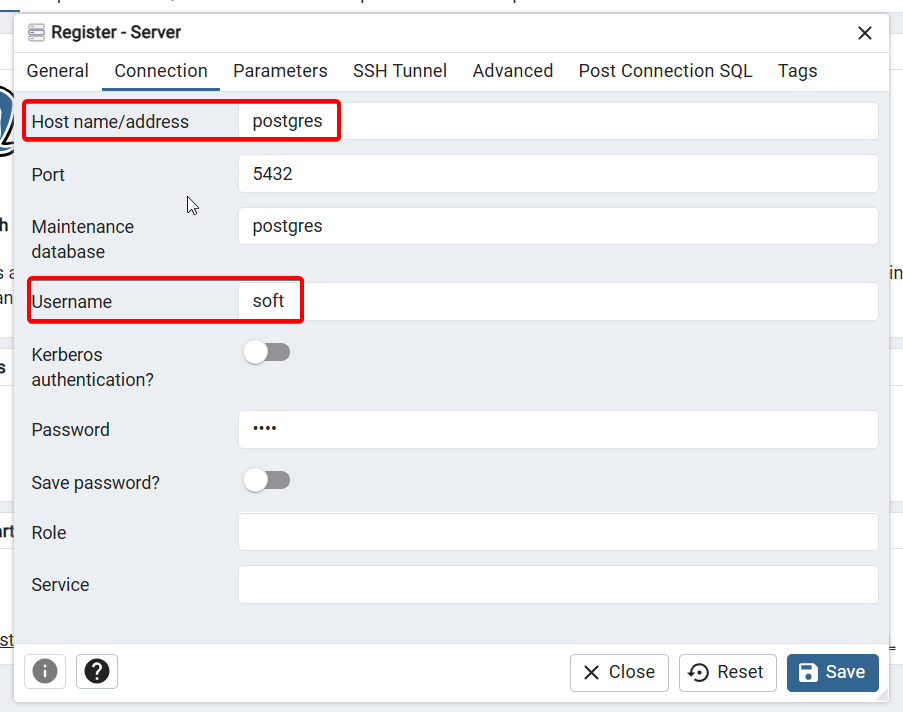

# Express + PostgreSQL API

A simple REST API using **Express** and **PostgreSQL**, containerized with Docker and powered by **Bun** for fast dependency management and runtime.

## 🚀 Requirements

Before getting started, ensure the following are installed on your system:

- [Docker](https://www.docker.com/products/docker-desktop)
- [Bun](https://bun.sh/)

## 🛠️ Setup Instructions

Follow these steps to get the project running locally:

### 1. Clone the Repository

```bash
git clone https://github.com/sapondanaisriwan/express-postgresql-api.git
cd express-postgresql-api
```

### 2. Create .env file
```bash
API_PORT=3001
POSTGRES_DB=express-crud
POSTGRES_HOST=172.19.0.2
POSTGRES_USER=soft
POSTGRES_PASSWORD=1234
POSTGRES_PORT=5432
```

### 3. Install Dependencies

Use Bun to install project dependencies:

```bash
bun install
```

### 4. Start the PostgreSQL Database

Spin up the PostgreSQL service using Docker Compose:

```bash
docker compose up -d
```

#### 5. Register the Server

Navigate to `http://localhost:5050/browser/` and register the server as following.



### 6. Start the Development Server

```bash
bun run dev
```
